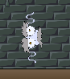
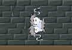

# Spring is in the Air

## Setting
Als King Spring während einer seiner Reden vom Balkon stolpert und daraufhin in die Kanalisation fällt, findet er sich in einer unglücklichen Lage wieder. Der hinterhältige Lord Mortimer hat das Unglück des Königs ausgenutzt und sich kurzerhand selbst zum König gemacht, um das Königreich nach seinen eigennützigen Wünschen zu regieren. Das Königreich versinkt im Chaos und es liegt an King Spring, auf seinem Weg zurück nach oben in sein Schloss die zerbrochenen Stücke seiner Krone finden, um sein Recht auf den Thron zu beweisen.

## Gameplay
Spring is in the Air ist ein Platform-Climbing Spiel, angelehnt an *Jump King* und *Getting Over it with Bennett Foddy*. King Spring muss in verschiedenen Leveln auf Objekte und Plattformen und mehr springen, um nach oben zu gelangen. Die Level sind dadurch so strukturiert, dass der Spieler an vielen Stellen herunterfallen und Teile seines Forschritt im aktuellen Gebiet verlieren kann. Durch das mehrfache Wiederholen der verschiedenen Sprünge bekommt der Spieler ein besseres Gefühl für die Sprungmechanik und lernt, auch schwierige Stellen zuverlässig zu überwinden. Trotz des damit verbundenen Frusts soll er nach und nach die Sprungmechanik meistern, um  die Level erfolgreich beenden zu können. In jedem Gebiet ist außerdem ein Bruchstück der Krone versteckt, welches vor Abschluss des Gebiets gefunden und aufgesammelt werden muss. einen Kameraschwenk zum Aufenthalt ders Kronenstücks erhält man im Dialog mit den Bewohnern des Königreichs.

## Charactere
- King Spring, der König von Kingdom Spring (Spielercharakter)
- Das Volk von Kingdom Spring, die unterstützenden Untertanen des Königs
- Der hilfsbereite Einwohner, am Einstieg in die Kanalisation
- Der letzte verbleibende Postbeamte, im Paketlager
- Mortimer, ein machthungriger Lord an King Springs Hof

## Spielablauf
- Einführung in Geschichte durch Introsequenz mit Bildern und Text
- kurze Einführung in Steuerung zum Spielstart
- in jedem der beiden Gebiete gibt es ein Kronenstück zu finden und am Ende einen Story-Dialog, in dem man mehr über die Umstände der Welt erfährt
- Gameloop: Spieler betritt neues Gebiet &#8594; arbeitet sich hoch und sammelt Kronstück &#8594; kann Gebiet abschließen &#8594; Spieler betritt neues Gebiet
- Nach Abschluss des zweiten Gebietes erwartet den Spieler eine Endsequenz mit Bildern und Text, welche das Ende der Geschichte illustriert

## Movement
Der Spieler kann King Spring dazu bringen, ...

| seitwärts zu laufen | sich auf einen Sprung vorzubereiten | sich während des Vorbereitens auf einen Sprung nach links oder rechtszu neigen | gerade oder seitwärts nach oben zu springen | 
|:-:|:-:|:-:|:-:|
||||

Mit diesen vier Bewegungsmustern ist der Spieler dazu angehalten, sich einen Weg durch die Tiefen der Kanalisation und die Höhen des Paketlagers von Kingdom Spring zu bahnen.

## Technische Funktionsweise des Spielercharakters
Der Spielercharakter ist komplett physikbasiert und kann durch das Ausüben von Kräften gesteuert werden. Sämtliche Interaktionen sowie Animationen werden dabei von Unitys Physikengine gehandhabt. 
Der Charakter besteht aus einer Kette von fünf unsichtbaren Würfeln (im Folgenden Glieder genannt), welche durch Spring Joints zusammengehalten werden.

Wird er nicht gerade vom Spieler bewegt, hat das unterste Glied immer eine Masse von 1,5 und wird logischerweise von der Erdanziehungskraft (37,81 Meter pro Sekunde²) nach unten beschleunigt, alle anderen Glieder haben eine Masse von je 0,1 und werden mit derselben Erdbeschleunigung nach oben gezogen, wodurch es scheint als stünde King Spring aufrecht.

| | |
| --- | --- |
|  | |
 |

### Laufen
Wird der Spielercharakter nach links oder rechts bewegt, wird alle 0,39 Sekunden die Coroutine „Walk“ gestartet. Diese bewegt zuerst das oberste Glied von King Spring durch Überschreiben seiner Geschwindigkeit in die gewünschte Richtung und tauscht kurze Zeit später die physikalischen Eigenschaften des obersten Gliedes mit denen des untersten Gliedes, was einen Überschlag simuliert. 

### Springen
Vor jedem Sprung sollte der Spieler durch Gedrückthalten seiner Leertaste seine Sprungkraft aufladen, King Spring wird dabei wie eine echte Sprungfeder gestaucht. Dies geschieht durch eine Verkürzung der Spring Joints, die den Charakter zusammenhalten. Außerdem wird die Luftreibung aller Segmente erhöht, um zu verhindern, dass King Spring bei dieser Verkürzung unkontrolliert hin- und herschwingt. Während dem Aufladen eines Sprunges kann sich King Spring nach rechts oder links neigen, um seinen Absprungswinkel zu verändern. Dies geschieht durch Ausübung einer Kraft auf das oberste Glied in die gewünschte Richtung.

Lässt der Spieler im zusammengezogenen Zustand die Leertaste los, erhält das oberste Glied gleichzeitig eine Masse von 1,5, eine Erdanziehungskraft in Richtung Boden und eine starke Aufwärtskraft, welche King Spring in die Luft schleudert und so das Springen ermöglicht. Alle anderen Glieder werden bis zum nächsten Aufprall schwerelos, was unserer Ansicht nach am besten aussieht.

Alle der eben beschriebenen Mechaniken sind in der Unity-Komponente [SpringController.cs](Assets/Scripts/SpringController.cs) implementiert.

## Quellen
Soundeffekte:
- Crown Pickup Sound Effect: [Happy Award Achievement](https://www.storyblocks.com/audio/stock/happy-award-achievement-hby-qcpmfplk8p0xm3q.html) von Storyblocks
- Walking Sound Effect 1: [Creaks](https://freesound.org/people/damsur/sounds/443244/) von damsur auf freesound
- Walking Sound Effect 2: [Creaks](https://freesound.org/people/damsur/sounds/443237/) von damsur auf freesound
- Pipe Collision Sound Effect: [Light_Steel_Pipe_On_Concrete_01.wav](https://freesound.org/people/dheming/sounds/177783/) aus dem „Metal“ Sample Pack von dheming auf freesound
- Wood Collision Sound Effect: [Footsteps Running On Wooden Floor Fast Pace.wav](https://freesound.org/people/ralph.whitehead/sounds/565713/) aus dem „Footsteps Foley“ Sample Pack von ralph.whitehead auf freesound
- Stone Collision Sound Effect: BF Slams Wall.M.wav aus der Fairlight Sound Library von Blackmagicdesign
